# Lakehouse Bitcoin

Pipeline de dados de mercado (BTC/USDT, candles diários) construído do zero:
ingestão via Binance, orquestração própria com Airflow em Docker, arquitetura
medalhão no Databricks (Unity Catalog + Delta Lake) e consumo num dashboard
Qlik Cloud com identidade visual própria.

Projeto pessoal, sem vínculo com nenhuma empresa — construído para aprender
e demonstrar engenharia de dados de ponta a ponta.

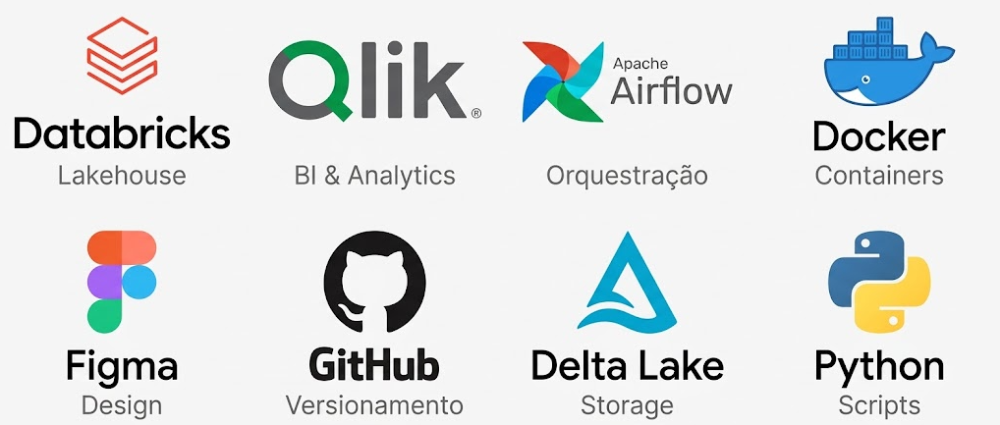

## A pergunta de negócio

Todo painel deveria existir para responder algo específico, não só para
exibir gráficos bonitos. Antes de escrever a primeira linha de SQL, defini
as perguntas que o Panorama precisa responder em menos de 10 segundos de
olhar:

- **O preço de hoje está caro ou barato, historicamente?** — resolvido pela
  distância da máxima histórica (drawdown) e pelas médias móveis.
- **O mercado está mais arriscado que o normal agora?** — resolvido pela
  volatilidade anualizada de 30 dias.
- **Existe um padrão sazonal que valha a pena considerar?** — resolvido
  pelo heatmap de retorno mensal e pelo retorno médio por dia da semana.
- **O volume de hoje é normal, ou está acontecendo algo fora do padrão?**
  — resolvido pelo indicador de volume relativo à média de 30 dias.

Cada tabela da camada Gold existe porque responde a uma dessas perguntas
— não o contrário. Isso guiou toda a modelagem: comecei pela pergunta,
não pela tabela.

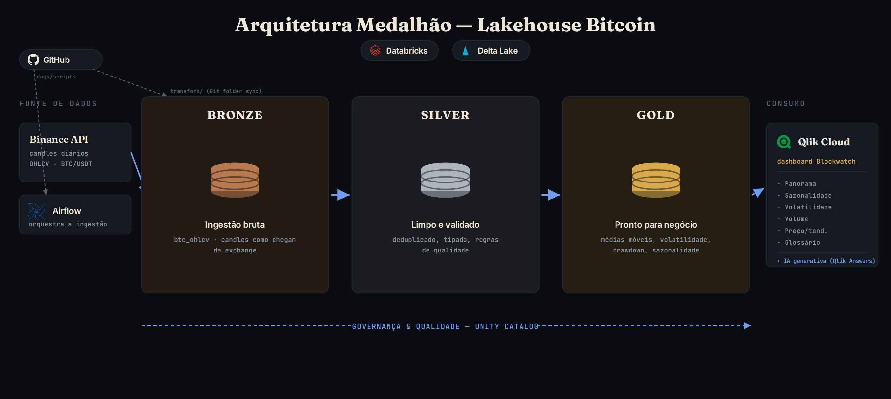

## Ambiente de desenvolvimento

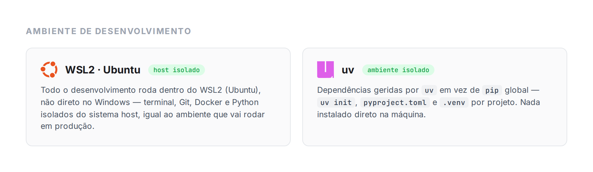

Desenvolvimento feito inteiramente dentro do WSL2 (Ubuntu) — não direto
no Windows — e dependências geridas com `uv` em vez de `pip` global,
mantendo cada projeto com seu próprio ambiente isolado, sem instalar
nada solto na máquina.

## O pipeline, de verdade

```
Binance API
    │  extração incremental, a cada hora
    ▼
Airflow (self-hosted, Docker) ── extrai → grava parquet → sobe pro Databricks
    │
    ▼
Databricks Free Edition — catálogo `bitcoin`, Unity Catalog
    │
    ├── bronze   candles brutos, como chegam da exchange
    ├── silver   deduplicados, tipados, validados (regras de qualidade)
    ├── gold     métricas de negócio: retornos, médias móveis, volatilidade,
    │            drawdown, sazonalidade
    ├── controle views de observabilidade do próprio pipeline
    └── documentacao  glossário de indicadores
    │
    ▼
Qlik Cloud — dashboard "Blockwatch", com IA generativa nativa (Qlik Answers)
```

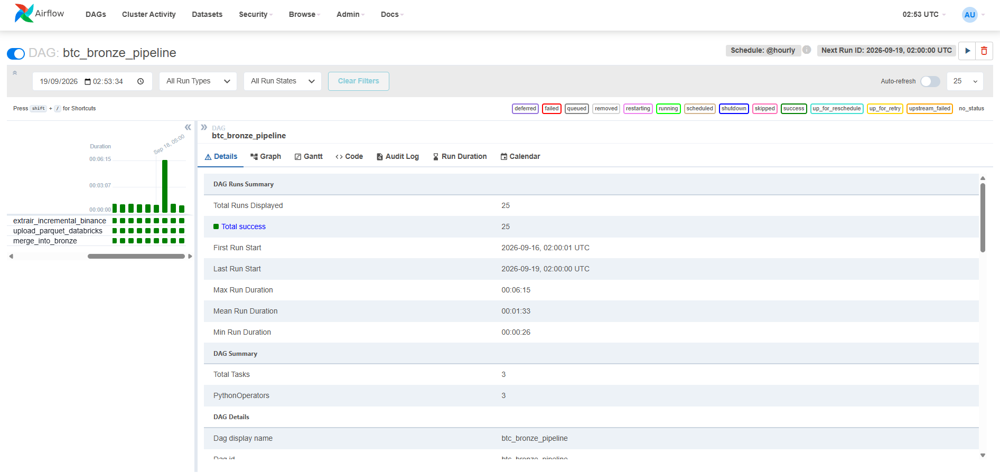
*DAG `btc_bronze_pipeline`, 25 execuções, 100% de sucesso, rodando de hora em hora.*

O Airflow não é um serviço gerenciado — é uma instância completa self-hosted,
subida via Docker Compose (scheduler, webserver, Postgres e um container de
git-sync), com todo o ambiente configurado do zero: variáveis, conexões,
e as bibliotecas Python que as DAGs precisam.

O ponto que mais gosto desse setup: **não existe deploy manual**. O
container `git-sync` fica observando o repositório no GitHub e clona
automaticamente qualquer novidade — quando uma nova DAG ou um script de
extração é commitado e enviado (`git push`), o Airflow detecta a mudança
sozinho e a DAG já aparece disponível na interface, sem precisar reiniciar
nada. O mesmo vale para adicionar uma biblioteca nova: basta declarar no
`requirements.txt` do projeto e subir o Docker de novo — sem tocar em
nenhum servidor manualmente.

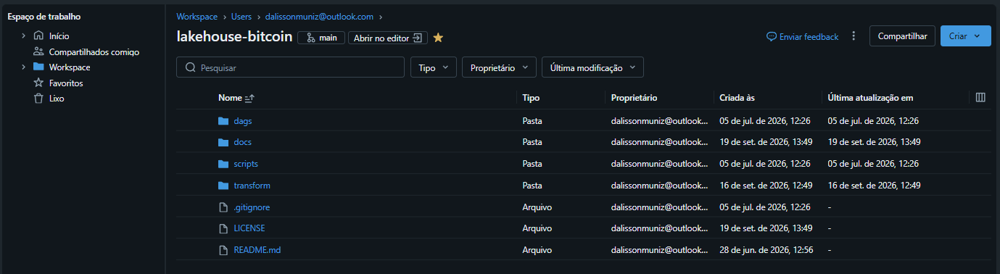

Outro ponto importante é toda integração entre as ferramentas, 
o Databricks também integrado com o GitHub - Combo (Airflow + GitHub + Databricks)
conectados, padronizados e versionados.

## Por que arquitetura medalhão, e não uma tabela só

A bronze recebe o mesmo dia mais de uma vez — a exchange grava o candle
aberto e depois fechado. A silver deduplica e valida (preço positivo,
máxima ≥ abertura/fechamento, etc.), descartando o que não passa numa
tabela de rejeitados à parte. A gold já entrega métricas prontas — médias
móveis de 7/30/50/200 dias, volatilidade anualizada, drawdown — para o
dashboard não precisar recalcular nada em tempo de consulta.

## Atualização automática das camadas Silver e Gold

A ponte entre a ingestão (Airflow) e o consumo (Qlik) é um **Job do
Databricks** com duas tarefas encadeadas — `carrega_silver_btc` e
`carrega_gold_btc`, a segunda só roda se a primeira terminar com sucesso.

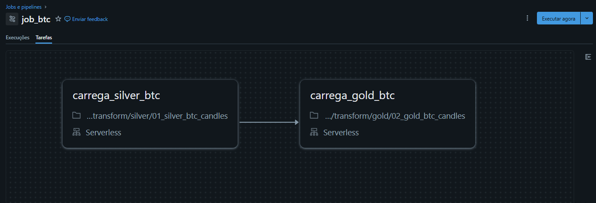

Nada disso roda por horário fixo. O gatilho é por **atualização de
tabela**: o Job fica observando `bitcoin.bronze.btc_ohlcv` e dispara
sozinho assim que a ingestão grava dados novos — sem cron, sem "chutar"
um horário com margem de segurança torcendo pros dados já estarem
prontos.

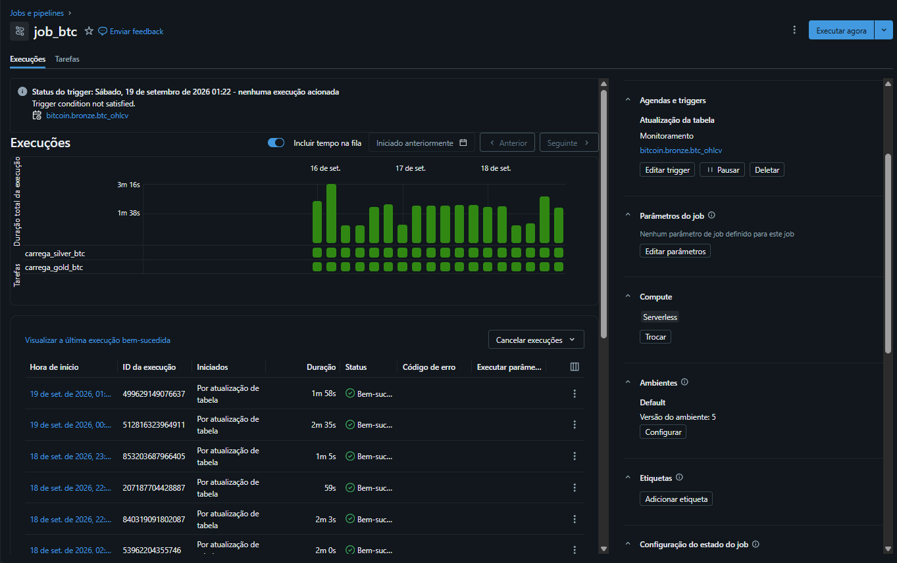
*Toda execução recente aparece como "Por atualização de tabela", entre 1 e
3 minutos de duração, sem nenhuma falha no período.*

## Governança, não só pipeline

Cada tabela tem comentário de coluna, com boa parte deles gerados com
apoio de IA (Genie) e revisados manualmente — inclusive achei e corrigi
alguns que soavam genéricos demais.

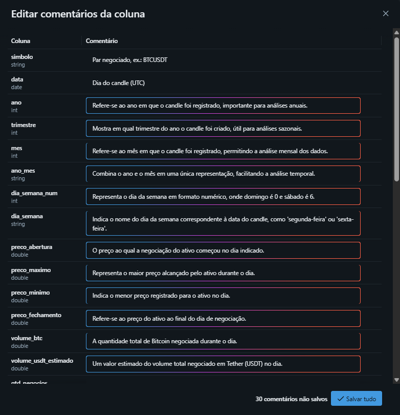

A linhagem é automática — dá pra rastrear qualquer número da gold até a
linha exata da bronze que o originou:

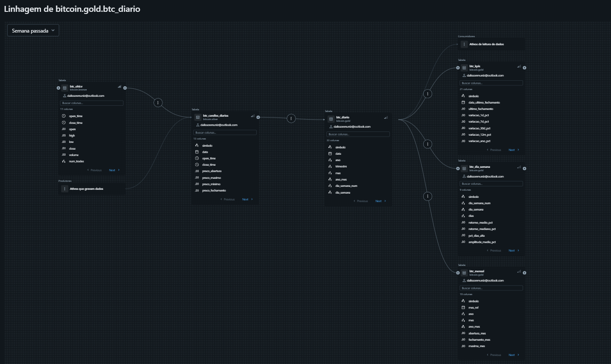

E as tabelas são Delta gerenciado de verdade, não CSV disfarçado — com
row tracking e deletion vectors habilitados:

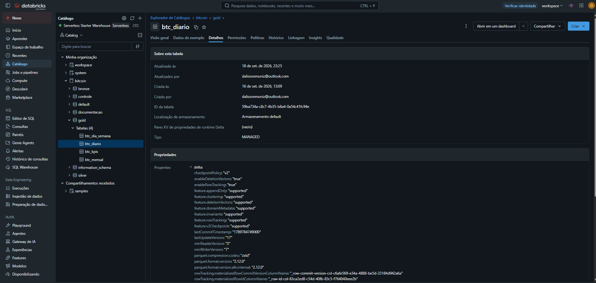

## Glossário de indicadores — documentação como parte do produto

Governança não pode parar no Catalog Explorer, onde só quem tem acesso ao
Databricks enxerga. Por isso o dashboard tem uma página própria de
Glossário, alimentada por uma tabela dedicada
(`bitcoin.documentacao.glossario_indicadores`): cada indicador do Panorama
tem definição em linguagem simples, fórmula de cálculo e a coluna exata da
Gold que o origina — rastreável até a fonte, igual à linhagem técnica, só
que legível por quem não é engenheiro de dados.

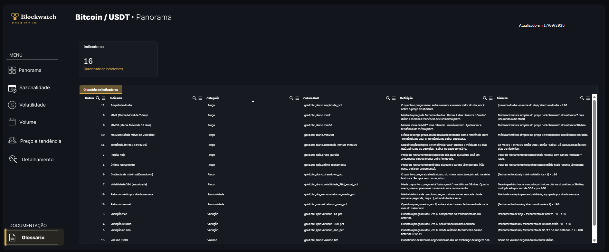

O próprio card "Quantidade de indicadores" no topo da página é dinâmico —
conta direto da tabela, então documentar um indicador novo no Databricks
já atualiza o dashboard, sem precisar editar nada manualmente no Qlik.

## Design antes de código

Antes de montar qualquer objeto no Qlik, o layout inteiro — sidebar,
paleta de cores, tipografia, espaçamento dos cards de KPI — foi desenhado
primeiro no Figma, como referência visual reutilizável para as próximas
páginas do dashboard (Sazonalidade, Volatilidade, Volume, Preço e
tendência). Isso evitou o problema mais comum de dashboard de BI: cada
página com um estilo levemente diferente, porque foi feita "no olho"
direto na ferramenta.

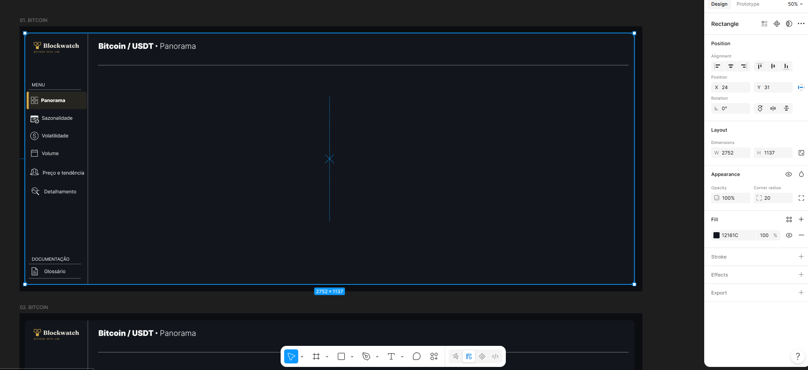

## O dashboard final

Identidade visual própria (Blockwatch), sem nenhum componente de
template pronto — cores, tipografia e ícones desenhados para o projeto.
O painel também usa IA generativa nativa do Qlik para responder perguntas
em linguagem natural sobre os dados.

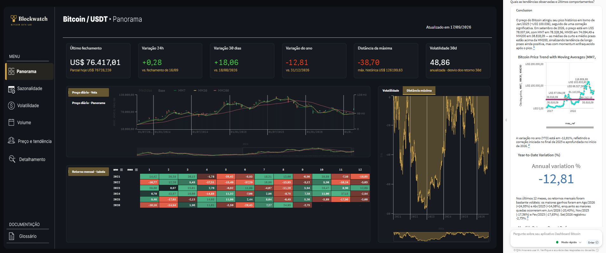

## Observando o próprio pipeline

Além do dashboard de negócio, montei um painel operacional nativo do
Databricks só para acompanhar a saúde da carga — volume processado por
camada, duração média, execuções por dia. Não é comum em projeto de
portfólio, mas é exatamente o tipo de coisa que se cobra em produção.

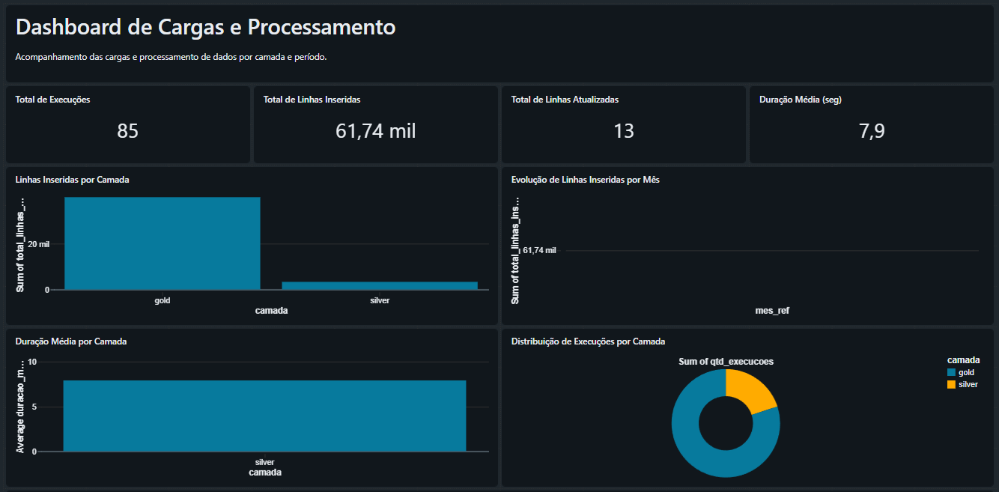

## Stack

| Camada | Tecnologia |
|---|---|
| Design | Figma — layout e sistema visual desenhados antes da implementação |
| Ingestão | Python (`requests`) · API da Binance |
| Orquestração | Apache Airflow, self-hosted em Docker (Docker Compose + git-sync) |
| Orquestração interna | Databricks Jobs, com gatilho por atualização de tabela (bronze → silver → gold) |
| Lakehouse | Databricks Free Edition · Delta Lake · Unity Catalog |
| Transformação | SQL (notebooks versionados no Git) |
| Governança | Unity Catalog: linhagem automática, comentários, controle de acesso |
| Documentação | Glossário de indicadores, versionado como tabela na Gold |
| Observabilidade | Dashboard nativo do Databricks sobre o histórico Delta |
| Consumo | Qlik Cloud, com IA generativa nativa |
| Versionamento | Git, sincronizado com o Airflow (git-sync) e o Workspace do Databricks |

## Estrutura do repositório

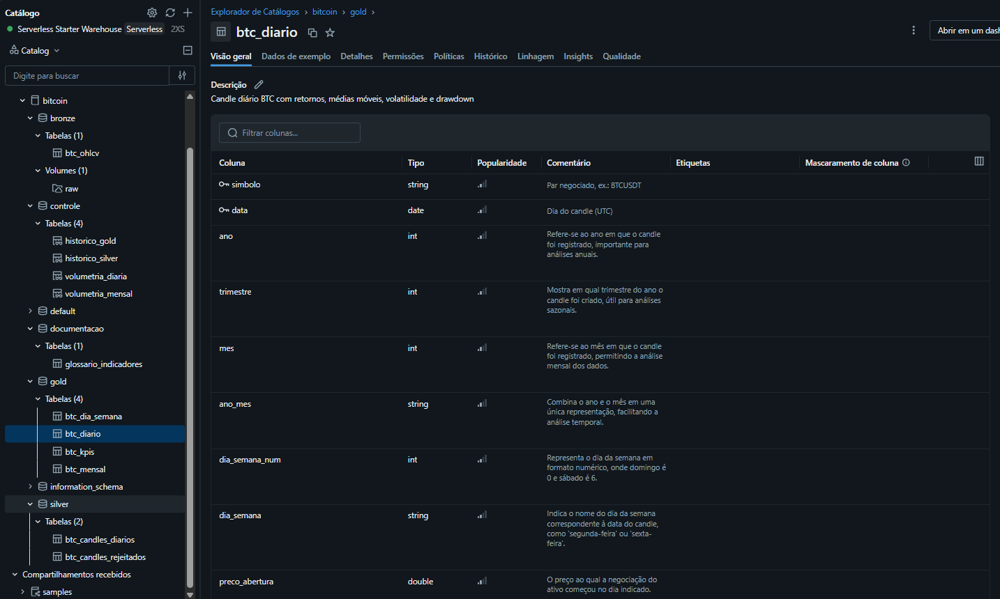

```
lakehouse-bitcoin/
├── dags/                  DAGs do Airflow (ingestão)
├── scripts/               scripts de extração da Binance
└── transform/
    ├── silver/            dedup, tipagem, regras de qualidade
    ├── gold/               métricas de negócio
    ├── monitoramento/      volumetria e observabilidade do pipeline
    └── documentacao/       glossário de indicadores
```

## Estado atual

O que já está rodando de ponta a ponta: ingestão incremental, três camadas
no Databricks com atualização automática por gatilho de tabela, governança
básica aplicada, glossário de indicadores publicado, e o dashboard no ar
no Qlik Cloud.

Próximo passo natural, se eu continuar: cruzar com indicadores
macroeconômicos (taxa de juros, por exemplo) — já testei a viabilidade de
puxar dados do FRED direto no Databricks, mas deixei fora do escopo desta
primeira entrega para não adiar o que já estava pronto.

## Licença

Distribuído sob a licença MIT — veja [LICENSE](LICENSE).

## Autor

Dalisson Silva ·· [LinkedIn](https://www.linkedin.com/in/dalisson-silva-a01a591a7/) ·· [GitHub](https://github.com/DalissonSilva)